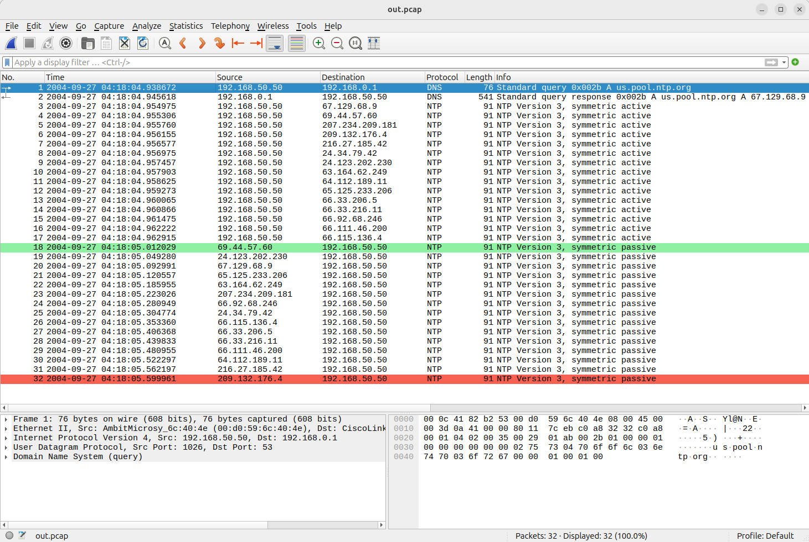

# PCAP Diff Tool 🔍
A Unix utility to highlight differences between two PCAP files, with the output viewable directly in Wireshark.

Perfect for debugging packet filtering, routing behaviour, and encapsulation differences.

## Features

- ⚙️ Byte Masking: Exclude dynamic fields like TTL, checksums, and counters from comparisons.

- 📦 Custom Byte Ranges: Specify which byte ranges to compare in each file. Ideal for ignoring headers or handling different encapsulation/link layers.

- 🦈 Wireshark Compatible Output: Generates a PCAP file that is viewable in Wireshark with colour highlighting.

- ⏳  Flexible Comparison Modes: Choose between full file search or timestamp-windowed comparison.

## Usage

```bash
pcap_diff [options] <fileA.pcap> <fileB.pcap>
```

Compare two PCAP files.

Required Arguments:

`<fileA.pcap>`
The first PCAP file to compare.

`<fileB.pcap>`
The second PCAP file to compare.

Returns:

- Returns 0 if files match
- Returns 1 if files differ
- Returns 2 on error

 Note that by default the program will not output a new PCAP diff file. Use `-o <out_file>` to generate a PCAP diff file.

# Optional Arguments

### `-n, --max-packets <num>`
Limits the number of packets compared from each file. Default is unlimited (0). 

Memory mapped file access is used, therefore the first N packets of very large files can be compared without loading the full files into RAM.

### `-m, --byte-mask <mask>`
Byte mask used to ignore certain bytes during comparison. 0: Don't compare the byte, 1: Compare the byte. If the packet is longer than the mask, then bytes after the end of the mask will be compared (i.e. it is assumed that the mask is padded with 1s for the length of the packet).

Example: `0000000000001111` will not compare the first 12 bytes of the packets. All other bytes will be compared.

Example: `10100` will not compare bytes 2, 4, and 5 (Indexed from one). All other bytes will be compared.

If a byte range is also selected, then the mask is applied to the selected byte range only. I.e. if the range of a packet is set to `[1:]` (skip the first byte), then a mask of `01` will skip comparing the 2nd byte of the packet (with all subsequent bytes being compared). Whereas, if no byte range is selected, then a mask of `01` will skip comparing the 1st byte of the packet.

### `-a, --range-a <range>`
Byte range to compare in each packet from file A.
Format: `[start:end]` (both optional). If `start` is omitted then 0 is assumed. If `end` is omitted then it is assumed the range extends to the end of the packet. A negative end index indicates an offset from the end of a packet. I.e. `[:-2]` will select all bytes except the last two bytes in the packet.

Default: `[:]` (Select full packet).

Example: `[14:]` skips the Ethernet header.

Example `[10:-2]` skip the first 10 bytes and the last 2 bytes of the packet.

### `-b, --range-b <range>`
Byte range to compare in each packet from file B. Same format as `--range-a`.

### `-A, --auto-time-align`
Automatically aligns timestamps by adjusting for time offset between files. (Not yet implemented)

### `-t, --time-offset-a <seconds>`
Applies a manual timestamp offset to file A. Useful if packets are delayed or clock-skewed. Positive values will adjust the timestamp forward in time. Negative values adjust the timestamp backwards in time. 

Example: `-0.01` would shift the timestamp backwards by 10 milliseconds.

Example: `86400` would shift the timestamp forward by 24 hours.

### `-T, --time-offset-b <seconds>`
Applies a manual timestamp offset to file B. Same format as `--time-offset-a`.

### `-d, --neg-time-diff <seconds>`
Maximum allowed negative time difference between packets when matching using the `timestamp` search method. Default: 0.01.

I.e. if set to 0.02, then a packet in file B can have a timestamp up to 20 ms earlier than a packet in file A and still be considered for matching.

### `-D, --pos-time-diff <seconds>`
Maximum allowed positive time difference between packets when matching using the `timestamp` search method. Default: 0.01.

I.e. if set to 0.02, then a packet in file B can have a timestamp up to 20 ms later than a packet in file A and still be considered for matching.

### `-s, --search-method <method>`
Packet matching method. One of:

`timestamp`: Match packets based on timestamp proximity (default)

`full`: Compare every packet in both files (Slow - Not suitable for large PCAP files)

`location`: Match packets by position in the file (Not yet supported)

### `-f, --output-format <format>`
Output diff format (for the resulting PCAP):

`basic`: Appends one byte to the end of all packets to indicate if the packet was matching (`0x00`), removed (`0x01`), or added (`0x02`). Modified and removed packets are sourced from `File A`. Added packets are sourced from `File B`. The timestamps in the output PCAP reflect the source file that the packet came from (with `--time-offset-a` and `--time-offset-b` applied). Wireshark row colouring can be used to highlight added and removed packets. The `basic` output format is the default format.

In order to use the `basic` output format, both PCAPs must have the same link layer.

`full`: Include all packets from both files encapsulated in a custom link layer so that Wireshark can show modified packets in the same row. Viewing this output format requires a Wireshark plugin.
This mode is not yet implemented.

`match_a`: Only packets from `File A` that matched.

`match_b`: Only packets from `File B` that matched.

`added`: Packets present in `File B` but not `File A`.

`removed`: Packets present in `File A` but not `File B`.


### `-o, --output <filename>`
Output PCAP filename. If not specified, no file will be output.

### `-v, --verbose`
Print detailed information during processing.

### `-h, --help`
Show the help menu.


## Examples

Basic comparison - No output file - Return value indicates if files differ:
```
pcap_diff capture1.pcap capture2.pcap
```
Compare only IP packet (skip Ethernet headers):
```
pcap_diff -a [14:] -b [14:] -o out.pcap capture1.pcap capture2.pcap
```
Compare only the IP packet, but skip the IP TTL (9th byte in IP header):
```
pcap_diff -a [14:] -b [14:] -m 111111110 -o out.pcap capture1.pcap capture2.pcap
```
Compare only the first 100 packets with timestamp-based matching:
```
pcap_diff -n 100 -s timestamp -o out.pcap capture1.pcap capture2.pcap
```
Use manual timestamp offset and write a full diff:
```
pcap_diff -t 0.5 -T -0.3 -f full -o diff_full.pcap capture1.pcap capture2.pcap
```
Output only added packets:
```
pcap_diff -f added -o added_packets.pcap capture1.pcap capture2.pcap
```

## Building
```
g++ -O3 --std=c++11 -Wpedantic -Wextra -Wall -Werror -Wfatal-errors pcap_diff.cpp src/packets.cpp src/packet_diff.cpp src/mapped_file.cpp src/pcap_reader.cpp src/pcap_writer.cpp src/timestamp.cpp src/pcap_file.cpp -I./include -o pcap_diff
```

## Wireshark Colouring - Basic Output Mode
When viewing a PCAP file generated using the `basic` output mode, Wireshark can be configured to highlight added packets in green, and removed packets in red.

To configure this highlighting, first save the following colouring rules into a text file.
```
@Removed@frame[-1] == 0x01@[63222,24929,20817][0,0,0]
@Added@frame[-1] == 0x02@[36751,61680,42148][0,0,0]
```

In Wireshark, go to `View -> Coloring Rules`. Then select `Import` and select the text file saved earlier. Finally, click on `Open`. Two new rules should be added.

The colouring rules work by looking at the value of the last byte of the packet. This byte was appended to the original packet by the `pcap_diff` tool.
The rules should be disabled or removed when not viewing a PCAP file generated by the `pcap_diff` tool, otherwise spurious colouring will occur.

The example below shows the result of comparing two files. `File A` contains one packet that is not in `File B` (highlighted in red), and `File B` contains one packet that is not in `File A` (highlighted in green). The rest of the packets are the same in both files.


